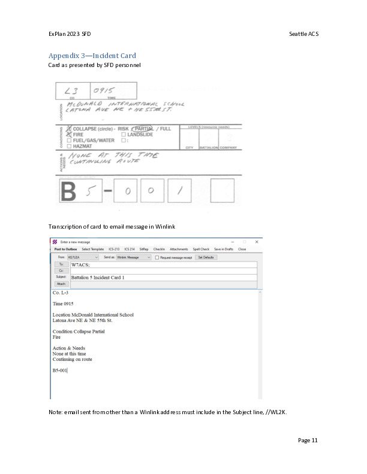
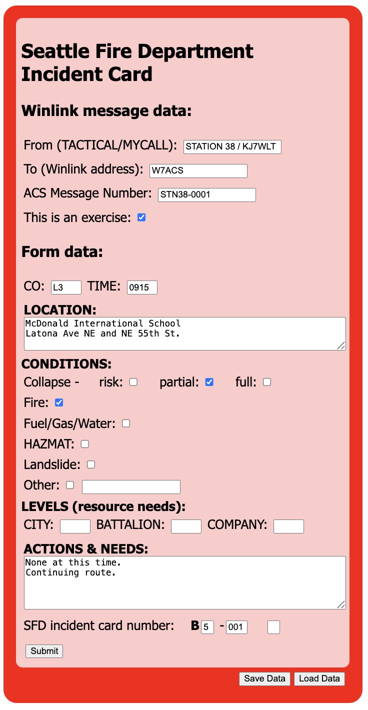

# Seattle Fire Department Incident Card

Work in progress to create a Winlink form to automate the process described
in this page from the Seattle ACS Action Plan for a recent SFD Windshield
Exercise:

## Draft 2026-01-19

### Form input:

### Resulting Winlink message:

    To: W7ACS;
    From: KJ7WLT
    Subject: Batallion 5 Incident Card 001  --- ACS msg # STN38-001

    ** THIS IS AN EXERCISE **

    Seattle Fire Department
    Batallion 5 Incident Card 001  --- ACS msg # STN38-001

    ========================
    CO: L3   TIME: 0915

    ------------------------
    LOCATION:
    McDonald International School
    Latona Ave NE and NE 55th St.

    ------------------------
    CONDITIONS:

    Collapse --
        risk:
        partial: X
        full:

    Fire: X
    Fuel/Gas/Water:
    HAZMAT:
    Landslide:
    Other:

    ------------------------
    LEVELS (resource needs):
    CITY:     BATTALION:     COMPANY:

    ------------------------
    ACTIONS & NEEDS:
    None at this time.
    Continuing route.

    ------------------------
    CARD NUMBER: 001

    ========================

    Sent by: STATION 38 / KJ7WLT
    ---
    Program version:1.7.29.0

## Try it:

You can type in [this live sample version](https://faculty.washington.edu/rjl/misc/SFD_incident_card-form.html).  The Submit, Save, and Load buttons do not do anything.

To try it in Winlink, copy these files into your Winlink Express `Global Folders\Templates` directory:

- SFD_incident_card-form.html
- SFD_incident_card-template.txt

Then compose a new message, selecting the template under `General Templates`.

## Notes:

- This is a draft. I'm soliciting input, see
  issue #1 for some specific questions and more
  about this draft.

- The Submit button should work if you install
  these files in Winlink Express.  The Save
  and Load buttons do not yet work properly.

- Many thanks to Jon K7RMZ for running a workshop and providing several examples at https://github.com/nojronatron/wl-forms-training

- The basic format of the current draft is based on Jon's example [4-form-style](https://github.com/nojronatron/wl-forms-training/tree/main/4-form-style).
