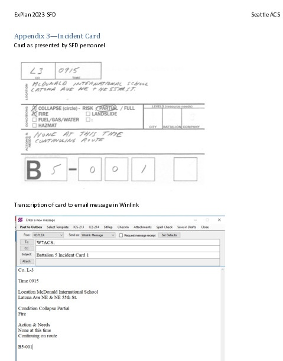
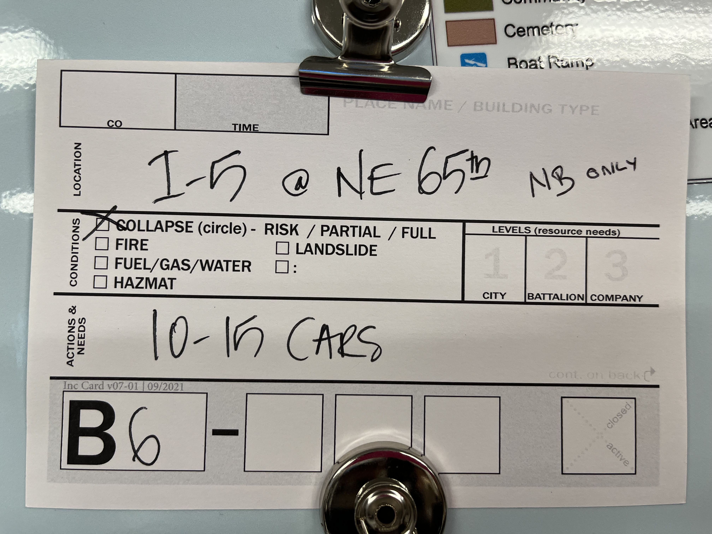
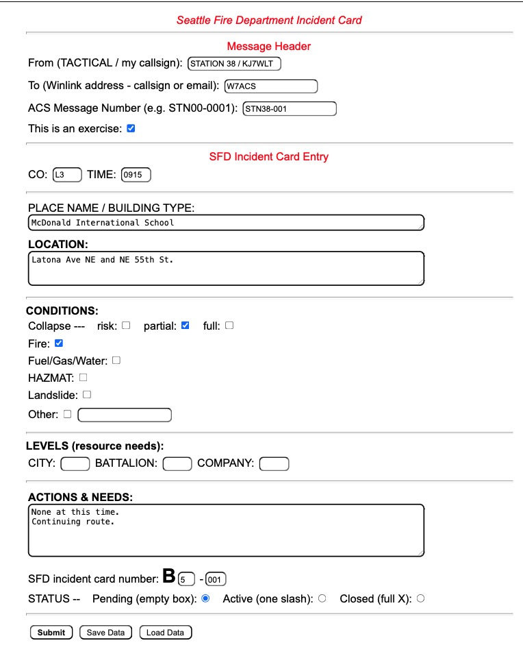
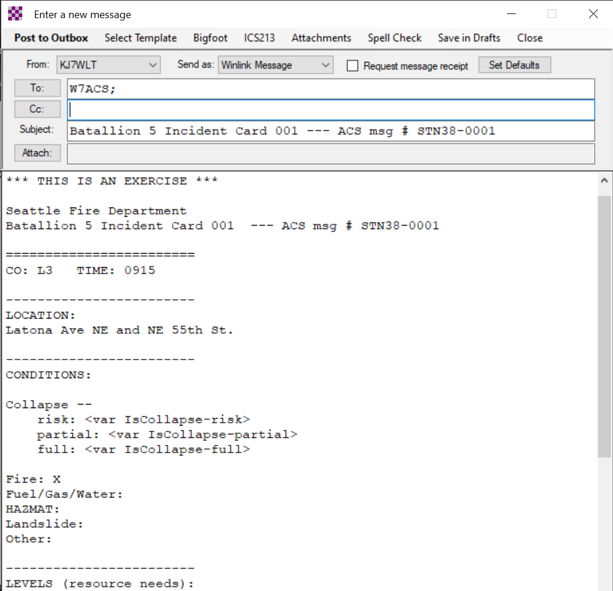

# Seattle Fire Department Incident Card

Work in progress to create a Winlink form to automate the process described
in this page from the Seattle ACS Action Plan for a recent SFD Windshield
Exercise:




## Another example incident card

This image has better resolution, note the faint writing:



## Draft of 2026-05-04

### Try out the web browser version

You can type into [this live sample version](https://faculty.washington.edu/rjl/misc/SFD_incident_card-form.html).  The Submit, and Load buttons do not do anything,
but the Save button should save a file to your local computer (which could
later be transferred to Winlink).

### Install in Winlink

To try it in Winlink, copy these files into your Winlink Express `Global Folders\Templates` directory:

- SFD_incident_card-form.html
- SFD_incident_card-template.txt

Then compose a new message, selecting the template under `General Templates`.
This should open a browser window that looks the same as the sample web version
above, but if opened from within Winlink the "Submit" button should work to
translate the html form information into a Winlink message, which you can
then "Post to Outbox".

The "Save Data" button should work too and eventually so will
the "Load Data" button, but this is not yet implemented.

Also not yet implemented is a Viewer version that allows an incoming Winlink
message based on this form to be nicely displayed in a browser.  But a recipient
will see the email message text, as illustrated below.


### Form input:



### Resulting Winlink message:



### What gets saved:

If you click "Save Data", a text file with a name like
`SFD-card-saved-data-2026-05-04-21_23.txt` will be saved, containing

```
{
  "MyCallsign": "STATION 38 / KJ7WLT",
  "ToCallsign": "W7ACS",
  "ACSno": "STN38-0001",
  "IsExer": "*** THIS IS AN EXERCISE ***",
  "company": "L3",
  "Time": "0915",
  "PlaceNameBuildingType": "McDonald International School",
  "location": "Latona Ave NE and NE 55th St.",
  "IsCollapse_risk": "",
  "IsCollapse_partial": "X",
  "IsCollapse_full": "",
  "IsFGW": "",
  "IsFire": "X",
  "IsHazmat": "",
  "IsLandslide": "",
  "IsOther": "",
  "other_desc": "",
  "levels_city": "",
  "levels_battalion": "",
  "levels_company": "",
  "actions": "None at this time.\nContinuing route.",
  "CardB": "5",
  "CardID": "001",
  "Status": "pending"
}
```

## Notes:

- This is a draft. I'm soliciting input.

- The "Load Data" button doesn't work yet.

- There's no Viewer form yet for converting an incoming Winlink message to a nice html version.

- Many thanks to Jon K7RMZ for running a workshop and providing several examples at
  https://github.com/nojronatron/wl-forms-training.  Some ideas also adapted from his [Bigfoot bib tracker form](https://github.com/nojronatron/Bigfoot-Bib-Report-WL-Form) and from some info on the Winlink pages, e.g. [create_template.pdf](https://winlink.org/sites/default/files/RMSE_FORMS/create_templates.pdf).
